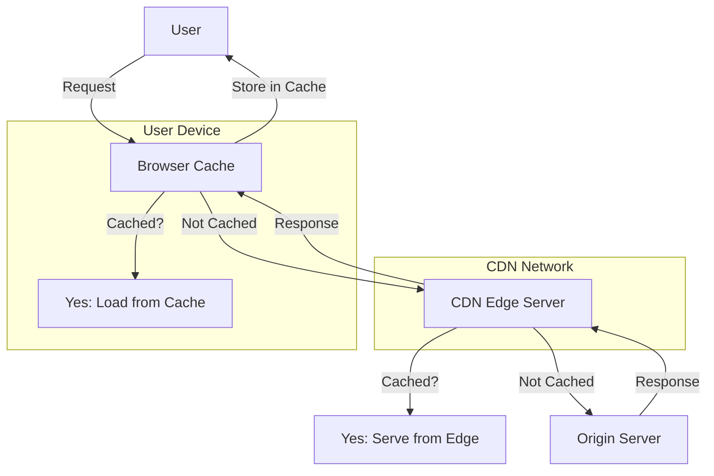

In the modern digital landscape, speed and efficiency are paramount for delivering web content to users. Two key technologies that help achieve this are **Content Delivery Networks (CDNs)** and **browser caching**. While both aim to improve website performance and user experience, they operate in fundamentally different ways. This article will explain what a CDN is, how it works, and how it differs from browser caching, complete with a diagram for clarity.

## What is a CDN?

A **Content Delivery Network (CDN)** is a distributed network of servers strategically placed across various geographic locations. Its primary purpose is to deliver web content—such as HTML pages, images, videos, and scripts—to users more quickly and reliably by reducing the physical distance between the user and the server hosting the content.

### How Does a CDN Work?

When a user requests content from a website (e.g., loading a webpage), the CDN routes the request to the nearest server in its network, known as an **edge server**. These edge servers cache (temporarily store) copies of the website’s static content, such as images, CSS files, and JavaScript files. By serving this content from a location closer to the user, a CDN reduces latency, minimizes server load, and improves page load times.

Key benefits of a CDN include:
- **Faster load times**: Content is delivered from a nearby server rather than a distant origin server.
- **Reduced server load**: The origin server handles fewer direct requests.
- **Improved reliability**: CDNs can handle traffic spikes and mitigate DDoS attacks.
- **Global reach**: Users worldwide experience consistent performance.

## What is Browser Cache?

**Browser caching**, on the other hand, is a mechanism built into web browsers to store copies of web resources locally on a user’s device. When a user visits a website, the browser downloads files like images, stylesheets, and scripts. Instead of re-downloading these files on subsequent visits or page reloads, the browser retrieves them from its local cache, speeding up the process.

### How Does Browser Caching Work?

When a browser requests a resource from a web server, the server can include **cache-control headers** in the response. These headers tell the browser how long to store the resource and under what conditions to reuse it. For example:
- A header might instruct the browser to cache an image for 30 days.
- On the next visit, the browser checks its cache, finds the image, and uses it instead of making a new request to the server.

Key benefits of browser caching include:
- **Reduced bandwidth usage**: Fewer requests are sent to the server.
- **Faster page loads**: Locally stored files are accessed instantly.
- **Offline access**: Cached resources can sometimes be used when the user is offline.

## Key Differences Between CDN and Browser Cache

While both CDNs and browser caching aim to optimize performance, they differ in scope, location, and control:

| **Aspect**            | **CDN**                              | **Browser Cache**                  |
|-----------------------|--------------------------------------|------------------------------------|
| **Location**          | Distributed network of edge servers | Local storage on the user’s device |
| **Scope**             | Serves multiple users globally      | Specific to an individual user     |
| **Control**           | Managed by website owners/CDN providers | Controlled by browser and cache headers |
| **Content Type**      | Typically static content (images, CSS, etc.) | Any cacheable resource (static or dynamic, depending on headers) |
| **First Request**     | Speeds up delivery from edge server | Requires initial download from server |
| **Subsequent Requests** | Still requires network request to edge server | Served directly from local cache |

### A Simple Example
Imagine you’re streaming a video:
- **With a CDN**: The video is cached on an edge server near your city, so it loads quickly without overburdening the origin server in another country.
- **With Browser Cache**: After watching the video once, your browser might store parts of it locally, so replaying it doesn’t require any network request at all.

## Diagram: CDN vs. Browser Cache

### Explanation of the Diagram
1. The **User** makes a request to load a webpage.
2. The **Browser Cache** checks if the resource is stored locally.
   - If yes, it serves the cached version immediately.
   - If no, it forwards the request to the **CDN Edge Server**.
3. The **CDN Edge Server** checks its cache.
   - If the content is cached, it delivers it to the browser.
   - If not, it fetches it from the **Origin Server**, caches it, and sends it back.
4. The browser stores the response in its cache for future use and displays it to the user.

## Conclusion

In summary, a **CDN** is a server-side solution that optimizes content delivery for all users by leveraging a network of distributed servers, while **browser caching** is a client-side solution that benefits individual users by reusing locally stored resources. Together, they complement each other: a CDN ensures fast initial delivery, and browser caching minimizes redundant requests. By understanding and utilizing both, website owners and developers can create a seamless and efficient user experience.