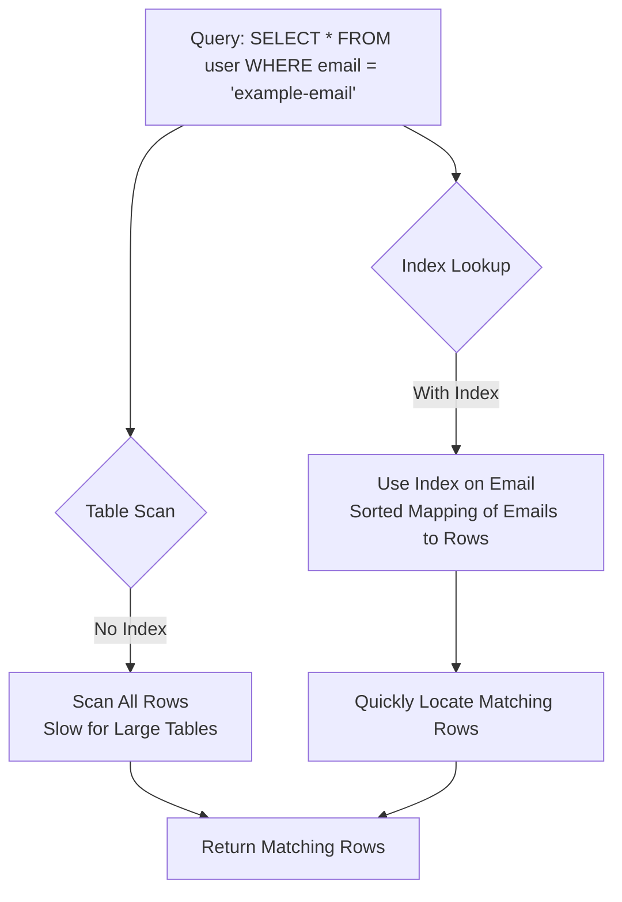

Indexes are essential for optimizing database performance in PostgreSQL, particularly when dealing with large datasets. When using TypeORM, a popular ORM for Node.js, you can create and manage indexes to enhance query efficiency. This article explains why indexes are necessary, how they work with a visual diagram, how to implement them with TypeORM and PostgreSQL, the benefits of specifying custom index names, and key considerations for effective use.

## Why Do We Need Indexes?

Indexes act like a table of contents for a book, enabling the database to quickly locate data without scanning every row in a table. Without indexes, PostgreSQL resorts to a **full table scan**, which can be prohibitively slow for large tables. Here’s why indexes are critical:

1. **Faster Query Performance**: Indexes significantly speed up `SELECT` queries, especially those involving `WHERE`, `JOIN`, `ORDER BY`, or `GROUP BY` clauses. For instance, searching for a user by email in a table with millions of rows is much faster with an index on the `email` column.
2. **Efficient Data Retrieval**: Indexes allow PostgreSQL to directly access relevant rows, reducing the amount of data processed. This is vital for read-heavy applications like web apps or APIs.
3. **Support for Constraints**: Unique indexes enforce data integrity (e.g., preventing duplicate email addresses) while also speeding up lookups.
4. **Optimized Complex Queries**: Specialized indexes, such as those for JSONB or full-text search, make complex queries feasible and efficient.

However, indexes have trade-offs:

- **Increased Storage**: Indexes consume additional disk space.
- **Slower Writes**: `INSERT`, `UPDATE`, and `DELETE` operations are slower because indexes must be updated.
- **Maintenance Overhead**: Indexes require periodic maintenance to remain efficient, especially after heavy write operations.

Despite these costs, indexes are often essential for maintaining performance as your database scales.

### How Indexes Work

An index is a separate data structure that stores a mapping of column values to the rows where they appear. For example, an index on an `email` column creates a sorted list of email addresses, each pointing to the corresponding row in the table. When a query filters by email, PostgreSQL uses the index to quickly find the relevant rows instead of scanning the entire table.

The following Mermaid diagram illustrates the difference between a query with and without an index:



In this diagram:
- Without an index, PostgreSQL scans every row in the table, which is inefficient for large datasets.
- With an index, PostgreSQL uses the index’s sorted structure to directly find the matching rows, significantly improving performance.

## Prerequisites

- Basic understanding of TypeORM and PostgreSQL.
- A Node.js project with TypeORM and the PostgreSQL driver (`pg`) installed.
- A PostgreSQL database connected to your TypeORM project.

## Creating Indexes with TypeORM

TypeORM allows you to define indexes using decorators in entity definitions. You can also specify custom index names for better control and clarity.

### 1. Single-Column Index

To speed up queries on a specific column, such as `email`, use the `@Index` decorator:

```typescript
import { Entity, Column, PrimaryGeneratedColumn, Index } from "typeorm";

@Entity()
export class User {
  @PrimaryGeneratedColumn()
  id: number;

  @Index()
  @Column()
  email: string;

  @Column()
  name: string;
}
```

This creates an index on the `email` column, optimizing queries like `SELECT * FROM user WHERE email = 'example@domain.com'`.

### 2. Composite Index

For queries involving multiple columns, create a composite index:

```typescript
import { Entity, Column, PrimaryGeneratedColumn, Index } from "typeorm";

@Entity()
@Index(["email", "name"])
export class User {
  @PrimaryGeneratedColumn()
  id: number;

  @Column()
  email: string;

  @Column()
  name: string;
}
```

This index improves performance for queries filtering or sorting by both `email` and `name`, such as `SELECT * FROM user WHERE email = 'example@domain.com' AND name = 'John'`.

### 3. Unique Indexes

To prevent duplicate values and speed up lookups, use a unique index:

```typescript
import { Entity, Column, PrimaryGeneratedColumn, Index } from "typeorm";

@Entity()
export class User {
  @PrimaryGeneratedColumn()
  id: number;

  @Index({ unique: true })
  @Column()
  email: string;

  @Column()
  name: string;
}
```

This ensures no two users can have the same `email` and optimizes searches for specific email addresses.

### 4. Specifying Custom Index Names

You can explicitly name an index using the `@Index` decorator with a custom name, such as `@Index('idx_work_category_workspace_id')`. This is particularly useful for composite or single-column indexes where you want a clear, maintainable name.

#### Example: Custom Index Name

```typescript
import { Entity, Column, PrimaryGeneratedColumn, Index } from "typeorm";

@Entity()
@Index('idx_work_category_workspace_id', ['category', 'workspaceId'])
export class Work {
  @PrimaryGeneratedColumn()
  id: number;

  @Column()
  category: string;

  @Column()
  workspaceId: number;

  @Column()
  title: string;
}
```

Here, the index `idx_work_category_workspace_id` is created on the `category` and `workspaceId` columns. This improves performance for queries like `SELECT * FROM work WHERE category = 'project' AND workspaceId = 123`.

#### Benefits of Specifying Custom Index Names

1. **Clarity and Maintainability**: A descriptive name like `idx_work_category_workspace_id` makes it easier to understand the index’s purpose when reviewing database schemas.
2. **Easier Management**: Custom names simplify tasks like dropping or modifying indexes, as you can reference the exact index name (e.g., `DROP INDEX idx_work_category_workspace_id`).
3. **Consistency Across Environments**: Default index names generated by TypeORM or PostgreSQL may vary or include random suffixes, causing inconsistencies between development, staging, and production environments. Custom names ensure uniformity.
4. **Debugging and Monitoring**: When analyzing query performance with tools like `EXPLAIN` or `pg_stat_user_indexes`, a meaningful index name helps quickly identify its role in query execution.

## Best Practices

1. **Index Strategically**: Create indexes only for frequently queried columns to minimize overhead.
2. **Use Descriptive Index Names**: Specify custom names (e.g., `idx_work_category_workspace_id`) for clarity and consistency.
3. **Test Query Performance**: Use PostgreSQL’s `EXPLAIN` to verify that indexes are being used effectively.
4. **Monitor Index Usage**: Check `pg_stat_user_indexes` to identify unused indexes that can be dropped.
5. **Maintain Indexes**: Periodically reindex (`REINDEX INDEX index_name`) to optimize performance.

## Common Pitfalls

- **Too Many Indexes**: Excessive indexes slow down writes and consume storage. Prioritize based on query patterns.
- **Case Sensitivity**: For text searches, consider case-insensitive indexes (e.g., `LOWER(column)`).
- **Inconsistent Index Names**: Without custom names, auto-generated index names can vary across environments, complicating maintenance.
- **Neglecting Maintenance**: Outdated indexes can degrade performance.